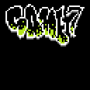

# Game 7

This prototype explores 8-bit/retro style gaming.

#### Title Screen



### Features include:
- Stateful Hot-reloading (via .DLL + file watcher)
- Metaprogramming (via [mikesmullin/metacode](https://github.com/mikesmullin/metacode/))
- Modular
- Object-Oriented (ie. `Class__Method` naming convention)
- Inheritance (via Struct Composition) w/ method overriding (via [Dispatcher](src/game/Dispatcher.c))
- Debug tools (sprintf to screen, Pixel Inspector, visual breakpoints, perf timers)

## Building

### on Windows
Start the game.
```
C:\> node build_scripts/Makefile.mjs all
```
Enable hot-reload. (ie. when editing [`Logic.c`](src/game/Logic.c))
```
C:\> node build_scripts/Makefile.mjs watch
```

## Inspirations

- Markus Persson 🇸🇪 ([@notch](https://x.com/notch))
   - **(Persson 2021)** *Prelude of the Chambered* - LD48
     [playthrough](https://www.youtube.com/watch?v=RE3dRh4wMc8) |
     [timelapse](https://www.youtube.com/watch?v=IoR-G8Ud0JM) | 
     [livestream](https://www.youtube.com/watch?v=GQO3SSlsgJM) |
     [code](https://github.com/skeeto/Prelude-of-the-Chambered) |
     [host](https://s3.amazonaws.com/ld48/index.html)
- Fyodor Agafonov 🇷🇺 ([Agafonoff](https://store.steampowered.com/pub/agafonoff_dev) | [@agafonoff_tw](https://x.com/agafonoff_tw))
  - **(Agafonov 2023)** DR LIVESEY ROM AND DEATH EDITION
    [steam game](https://store.steampowered.com/app/2181930/DR_LIVESEY_ROM_AND_DEATH_EDITION/) |
    [playthrough](https://www.youtube.com/watch?v=70OfnvGp1MU) |
    [original music](https://soundcloud.com/ghostfaceplaya/why-not)    
    - aggressive "phonk" genre
    - 3d and many quads but all bitmap sprite textures [cross-plane billboarding](https://www.reddit.com/r/gamedev/comments/q2qbp2/what_is_it_called_when_two_billboarded_sprites/)
    - [memes](https://www.youtube.com/watch?v=lrTcb3Kx1zM)!
- jdh 🇩🇰 ([@jdah__](https://x.com/jdah__))
  - https://www.youtube.com/watch?v=PcMua73C_94
  - https://www.youtube.com/watch?v=fSjc8vLMg8c
  - https://www.youtube.com/watch?v=KyhrqbfEgfA
  - https://www.youtube.com/watch?v=b5ovU9xeQ7c
- Zeekerss ([@ZeekerssRBLX](https://x.com/zeekerssrblx?lang=en))
  - https://store.steampowered.com/app/1717770/The_Upturned/
  - https://store.steampowered.com/search/?developer=Zeekerss
- David Szymanski 🇺🇸 ([@DUSKdev](https://x.com/DUSKdev))
  - https://store.steampowered.com/app/519860/DUSK/
  - https://store.steampowered.com/developer/davidszymanski/#browse

## References

- Wolfenstein/Doom vs. Quake style Rendering
  - [ChatGPT Analysis](docs/90s-raycasting.md): No worries brah. GPT can ELI5 Notch's crypticly-abbreviated and 100% uncommented code, probably better than the author himself.
  - [Permadi’s Raycasting Tutorial](https://permadi.com/1996/05/ray-casting-tutorial-table-of-contents/): This classic resource provides a detailed step-by-step guide to raycasting, including wall detection, fisheye distortion correction, and basic shading techniques. It's accompanied by demos and interactive examples to help visualize the concepts, especially for beginners.
  - [Tim Wheeler’s Wolfenstein 3D Raycasting Tutorial in C](https://timallanwheeler.com/blog/2023/04/01/wolfenstein-3d-raycasting-in-c/): This blog post dives into the math and code behind raycasting in C, offering explanations on how to compute ray directions, handle wall intersections, and render columns of pixels efficiently. It’s a good resource for programmers working in C.
  - [Gabriel Gambetta’s 2.5D Engines and Raycasting Tutorial](https://gabrielgambetta.com/computer-graphics-from-scratch/02-basic-raytracing.html): A detailed modern take on the subject, explaining how to implement 2.5D rendering using raycasting. It covers everything from ray generation to texture mapping and optimizing the rendering process for smooth performance.
- C String Manipulation
  - https://www.youtube.com/watch?v=2wio9UOFcow
- C Arena Memory Management
   - https://www.youtube.com/watch?v=TZ5a3gCCZYo
   - https://www.youtube.com/watch?v=3IAlJSIjvH0
   - https://www.youtube.com/watch?v=Tc763vPm4Ws
- 3D Transforms & Perspective Projection Math
  - https://www.youtube.com/watch?v=rvJHkYnAR3w
  - https://www.youtube.com/watch?v=o-xwmTODTUI
  - https://www.youtube.com/watch?v=7Gtxd-ew4lk
  - https://www.youtube.com/watch?v=wciU07gPqUE
  - https://www.youtube.com/watch?v=U0_ONQQ5ZNM
  - https://www.youtube.com/watch?v=JC5IMfK7Yfw
  - https://www.youtube.com/watch?v=rs4B8-qoY1I
  - https://chatgpt.com/share/66f4c8ea-db3c-8009-b897-c56886dd3b3b
- Quad Trees
  - https://www.youtube.com/watch?v=OJxEcs0w_kE
  - https://www.youtube.com/watch?v=QQx_NmCIuCY
  - https://www.youtube.com/watch?v=z0YFFg_nBjw
- DST BehaviorTree (AI), StateGraph (Animation), and Components (ECS)
  - https://github.com/taichunmin/dont-starve-together-game-scripts
  - https://www.youtube.com/watch?v=1ieGQ_YddX0
- ECS
  - https://www.youtube.com/watch?v=71RSWVyOMEY
- Game Design
  - [The Art of Game Design: A Book of Lenses](https://www.amazon.com/gp/product/B08LDSZG1W/)

## Cool Tools

- [jsfxr](https://sfxr.me/) 8-bit audio generator
- [raylib](https://www.raylib.com/) all-in-one cross-platform lib (replaces several I'm using now; will try next time)
- [victor.js](http://victorjs.org/) 2d vector math lib (may translate to c)
- [kenney](https://www.kenney.nl/assets) affordable game art
- [x64dbg](https://x64dbg.com/) catches breakpoints on memory access violation
- [fantasy namegen](http://rinkworks.com/namegen/) surprisingly nuanced
- [p5.js](https://p5js.org/reference/) math visualization aid
- [sokol](https://github.com/floooh/sokol) newer (more secure?) alternative to stb (cross-platform, tiny/cute header-only libs)

